<html lang="en">
  <head>
        <link rel="stylesheet" href="webPage.css">
  </head>

  <body>

     

       <h1>   Wheelchair Workout Tracker  </h1>
       <h3 style="font-size:50%">   Prototyping Connected Products - Group 3
           Caiseal Beardow, Yu Zhang & Kiki Deurvorst </h3>
     

     

       

         

           <h2> Our Project </h2>
           <h5>A connected wheelchair to track live workout data</h5>
           
 Our project aims to support manual wheelchair users in maintaining an active lifestyle. We envision our project as a workout tracker, similar to existing commercial examples, such as NikeRun or FitBit, but adapted specifically to the physical properties of a manual wheelchair and the practicalities of its use. Using sensors, microprocessors and a Raspberry Pi, we connect the physical components of our system to a visual interface that shows users their workout progress and statistics in real-time. 

           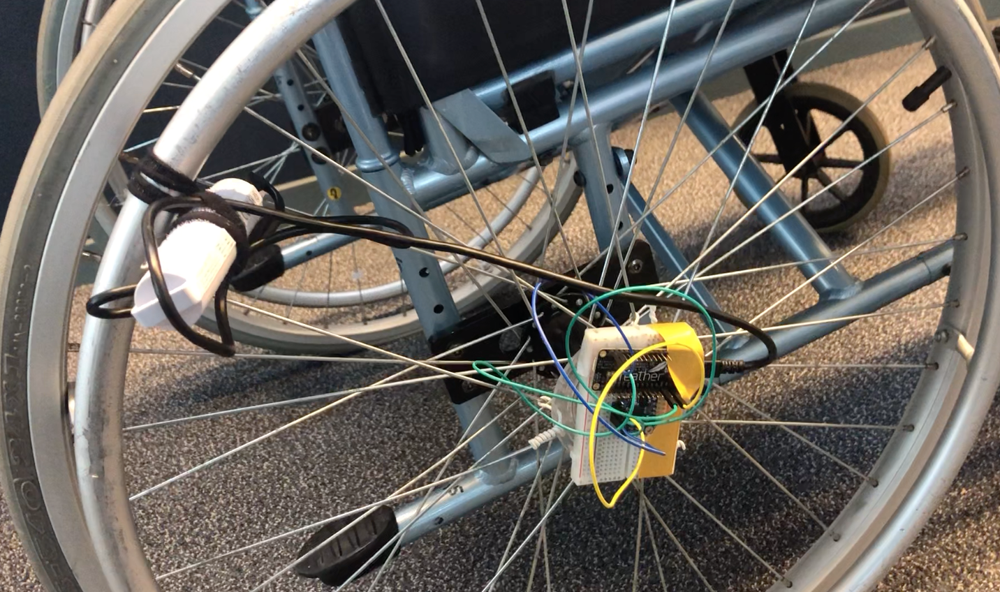
         

         

           <h2> Design Brief </h2>
           <h5>Connecting a wheelchair</h5>
           
 “While the population of wheelchair users is growing worldwide, it becomes urgent to design supportive technologies that fit their needs. We aim to develop products for improvement of the wheelchair users’ wellbeing. This design is a connected product that collects data from sensors and processes it in order to actuate user interactions embedded in the wheelchair.”
               
                Building upon this brief, we envision our target user group as (either full- or part-time) manual wheelchair users aiming to work towards or maintain a healthier, more active lifestyle. Features of our connected product include location, distance and activity tracking (via GPS and accelerometer sensors), visualised through a UX interface, with the intention of developing a mobile app-based product.
           

         

         

           <h2> System Architecture </h2>
           <h5> A sytematic overview of the architecture used for the prototype </h5>
           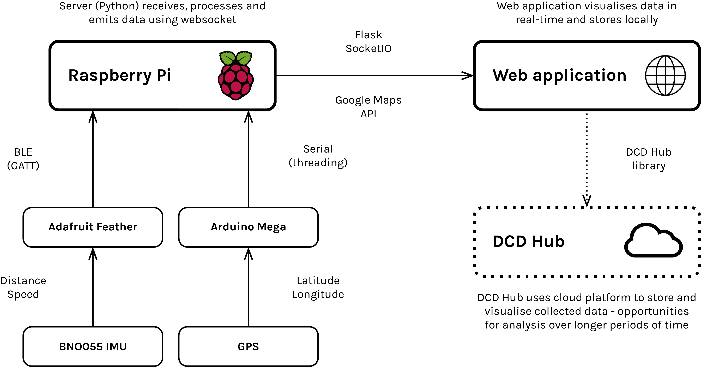
         

         

           <h2> Components </h2>
          
 The core of our connected system is a Raspberry Pi. The Pi runs a central Python script that receives data from sensors, processes it, initialises a server and websocket application, and sends processed data to this websocket.
             
             
            Associated HTML, CSS and JavaScript files are combined to produce an interactive web-based application that visualises users’ workout data in real-time.
              
            We use two sensors to receive relevant data:
             
            Adafruit BNO055 Absolute Orientation Sensor;
             
            Adafruit Ultimate GPS Breakout.
              
            When mounted on the wheelchair’s wheel axle, the BNO sensor provides us with rotation data that is then used to calculate cumulative distance travelled and, in combination with time elapsed,
            a user’s current speed. This data is sent to the Pi via Bluetooth using GATT commands.
              
            The GPS sensor is connected to an Arduino Mega that collects and formats coordinates, then sends them to the Pi via serial communication.
              
            The Python script running on the Pi parses these data and packages them in a format that is usable by the JavaScript files implemented in our web application. Using a websocket, data is visualised in real-time and updated accordingly as the user moves with their wheelchair.
          

         

         

           <h2> Process Summary </h2>
           <h5> For a detailed explanation of all the steps, refer to the technical details below. </h5>

            
  1. Read IMU data from feather 

              

                Read data from BNO with on feather       
                Process data on feather  (distance and speed)    
              
  

            
 2. Set up GATT service on feather 

              

                Create GATT characteristics for speed and distance        
                Create GATT service (using ID’s)   
              
 

            
   3. Subscribe to GATT service on pi    

              

                Define characteristics in python script using ID’s     
                Initialise Bluetooth adapter using pygatt library     
                Use PYGATT library to subscribe to characteristics set in arduino script 
              
 

            
 4. Read and print GPS data over serial  

              

                Read longitude and latitude from gps sensor     
                Parse using adafruit library        
                Print it over serial 
              
 

              
 5. Read and process GPS data from serial  

              

                In python, we create a serial communication function that opens a connection with the serial port        
                Read incoming data and decode it (coming in as bytes                
                Place incoming data in an array and split by commas (strip and split functions)      
                Assign relevant index values to latitude and longitude variables               
                Place serial comms function inside thread - this separates out serial comms from the rest of the code and allows it to run concurrently. If we didn’t do this, serial comms would block the rest of the code as it includes a while loop. 
              
 

              
 6. Set up websocket  

              

                Set up websocket using flask and flask.io, creating routes for each app address (1 address = 1 HTML file) 
                Emit data as JSON objects, broadcasting to all instances of web page 
                Create websocket functions corresponding to each JSON object type 
              
  

              
 7. WebApp - Actuate data on online webPage   

              

                Create web interface with HTML/CSS - three pages (start/workout/summary), link them together using Javascript  
                Create JS script that uses socket.io.js (JS file hosted online by socket.io developers) to receive JSON objects from Python script, parse JSON objects and assign the resulting data to variables 
                Use HTML DOM element objects to insert these variables into webpage structure (i.e. displayed text) 
              
  

              
 8. Google Maps API  

              

                Use Google Maps API to use variables produced from GPS JSON objects as map coordinates  
              
  

              
 9. Localstorage for workout summary 

              

                Create JS script that uses localStorage to keep track of accumulated user data in a session, then passes it to summary page HTML  
              
  

            

         

           <h2> Technical Details of the Process </h2>

<!-- step1 -->
  
 Step 1: Read IMU data on feather 

          
 The IMU (BNO055) along with the Feather is placed on the axle of one side of the wheelchair. It calculates the cumulative number of rotations made by the wheel, which is then processed to calculate cumulative distance travelled and current speed.
               
            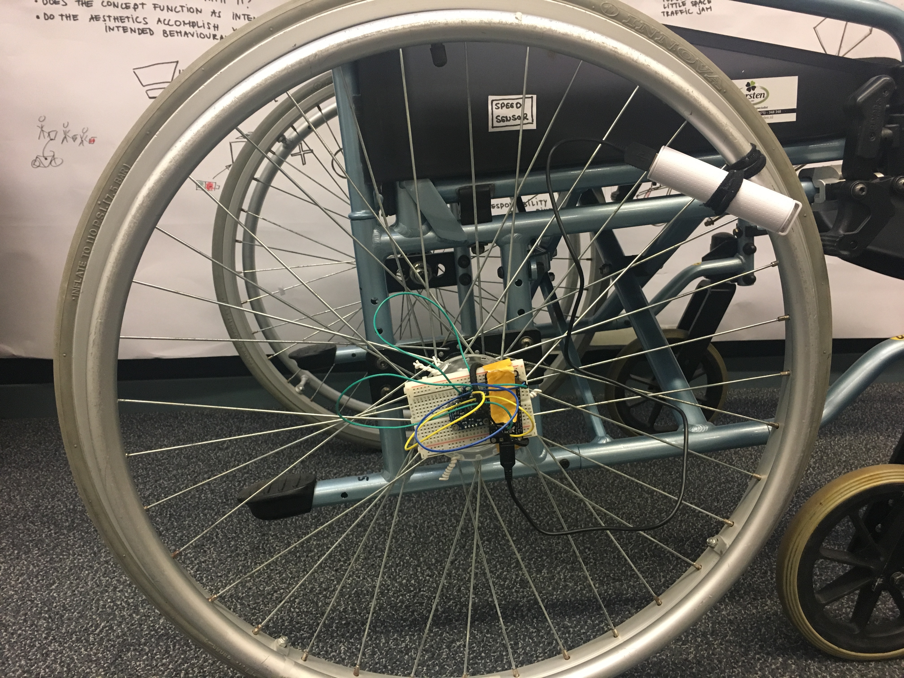
               
            Connection of Feather to BNO055: 
            	3V 	----- 	VIN 
            	GND 	----- 	GND 
            	SDA 	----- 	SDA 
            	SCL 	----- 	SCL
              
            BNO055 is a 9 degrees of freedom IMU. It contains a gyroscope, an accelerometer and a magnetometer. To run this sensor in Arduino, the Adafruit Sensor and Adafruit BNO055 library need to be included.
              
            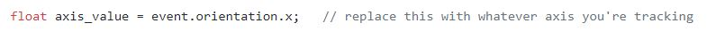
              
            After creating a sensor event, by calling the orientation function and specifying the axis (here is x from xyz), the Euler angle of the sensor position around that axis will be calculated. In the case of our wheelchair, the axis of the wheel overlaps with the x axis of the sensor, so the Euler angle of the sensor along the x-axis corresponds to the wheel’s rotation.
               
            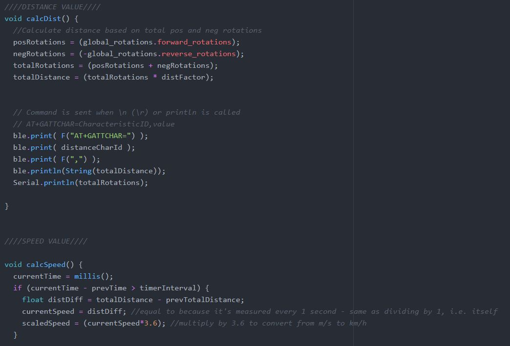
              
            Based on that, we can calculate cumulative total wheel rotations and multiply this by the circumference of the wheel to find distance travelled. Then the speed can be calculated at a set time interval.
             
            For detailed information, go to https://datacentricdesign.org/docs/2019/04/30/sensors-orientation
          

<!-- step 2  -->
  
 Step 2: Feather to Pi (BLE) 

          

                In order to send data between the feather and the pi, we need to set up GATT characteristics and a GATT service on the feather.
                  
                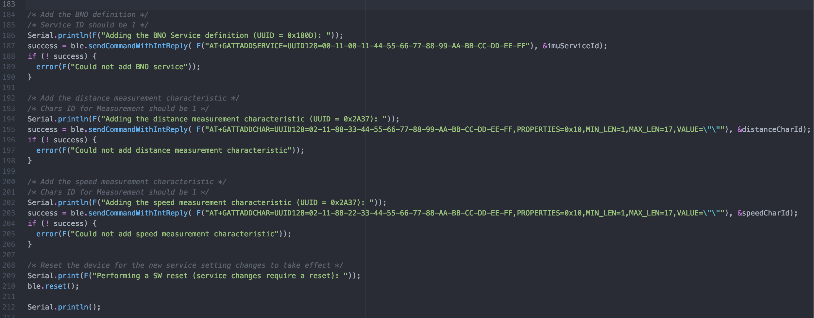
                  
          

<!-- step 3  -->

 Step 3: Subscribe to GATT service 

          

                We define the characteristics in our python script using the same ID’s set in the arduino script.
                  
                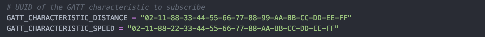
                  
                We must then initialise the Bluetooth adapter using the pygatt library and use this library to subscribe to the characteristics.
                  
                
                  
                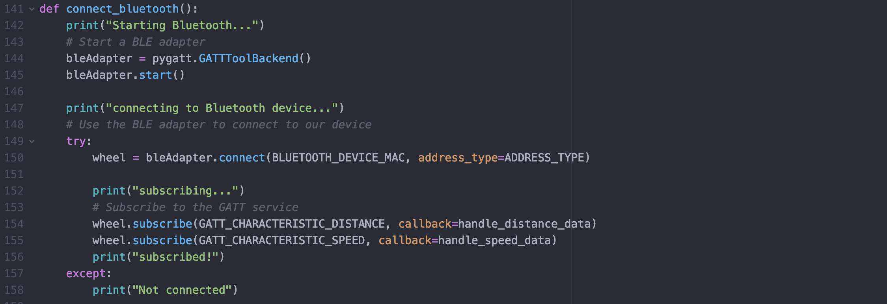
                  
          

<!-- step 4  -->

 Step 4: Read GPS on arduino mega 

            

                An Adafruit Ultimate GPS is connected to Arduino Mega. It collects GPS data of its location automatically once it is turned on.
                  
                
                  
                  Connection of Mega to GPS: 
                	5V 	----- 	VIN 
                	GND	----- 	GND 
                  RX	----- 	TX1 
                  TX 	----- 	RX1
                    
                With an empty script running on the Mega, the GPS sends raw NMEA data including connected satellite, current time, latitude, longitude and altitude to the serial port. Since only the latitude and longitude is needed to define a location in the Google Maps API, the Mega needs to run a script that can parse the raw data and then output the latitude and longitude data. To run the whole script, the Adafruit GPS library needs to be included. The image below shows the loop function of the script. After parsing the NMEA data, the latitude (latdeg) and longitude (longdeg) needs to be printed and thus sent to the serial port. Here Serial.print(latdeg, 8) formats the latitude data as a float value with 8 decimals. If this is not specified, by default only 2 decimal places will be printed. Google Maps requires an 8 decimal float as its latitude and longitude input, so here it is needed to serial print 8 decimal places.
                    
                  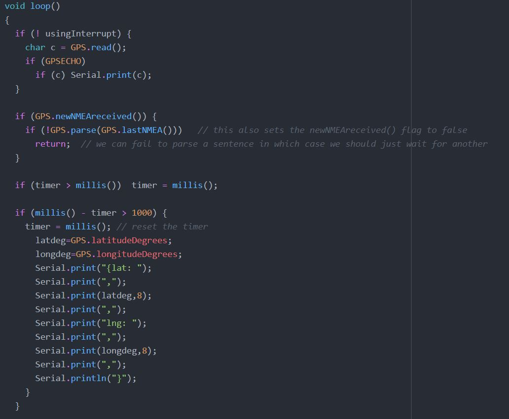
                    
                  For detailed information, go to https://datacentricdesign.org/docs/2019/04/30/sensors-gps.
                    
            

<!-- step 5  -->

 Step 5: Read GPS data from serial, process in thread  

            

                  In python, we create a serial communication function that opens a connection with the serial port.
                    
                  
                    
                  In order to use the incoming data, which is coming in as bytes, we need to decode it. We then place the incoming data in an array and split it by commas (strip and split functions). (In our preceding Arduino script, we printed latitude and longitude data with commas in between, to allow us to split the data in this way.)
                    
                  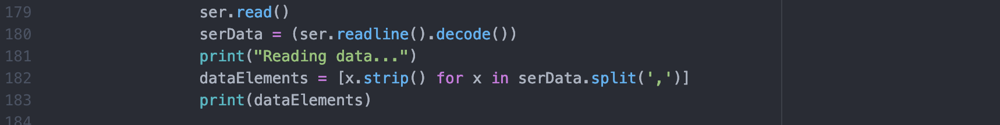
                    
                  We then assign data at relevant index values to latitude and longitude variables that can be sent through a websocket.
                    
                  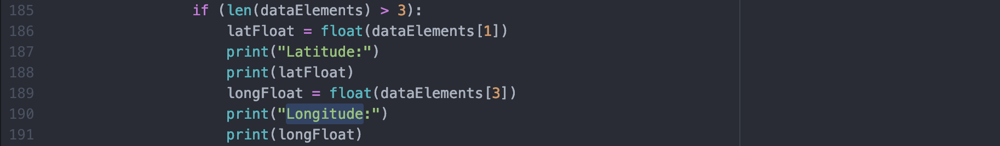
                    
                  We also place the serial comms function inside a thread - this separates out serial comms from the rest of the code and allows it to run concurrently. If we didn’t do this, serial comms would block the rest of the code as it includes a while loop. Threading allows us to place serial comms in a separate flow of execution.
                    
                  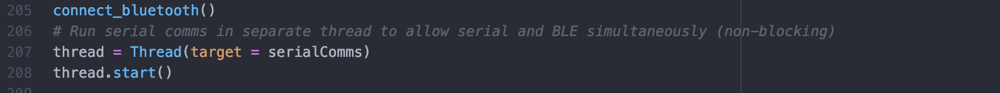
                    
            

<!-- step 6  -->

 Step 6: Websocket  

            

                  In order to display our continuously updating GPS, speed and distance data in a browser, we must set up a websocket. We do this using flask and flask_socketio, creating routes for each app address (1 address = 1 HTML file).
                    
                  
                    
                  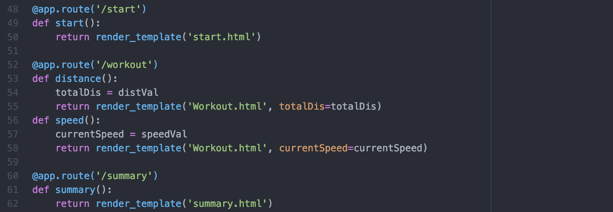
                    
                  The data is emitted as JSON objects, broadcasting to all instances of web page.We create websocket functions corresponding to each JSON object that we send.
                    
                  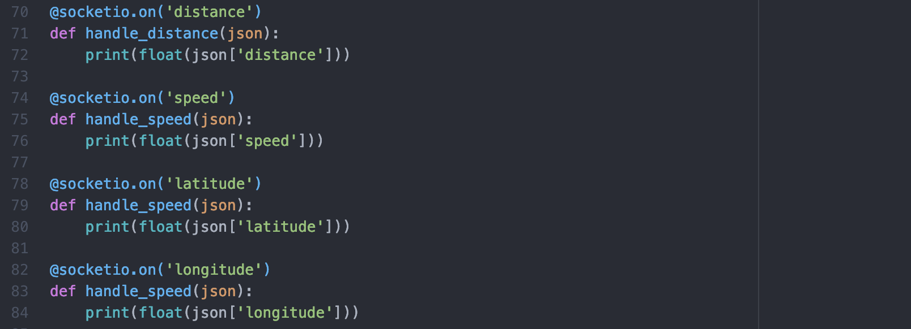
                    
            

<!-- step 7  -->

 Step 7: WebApp 

                

                      In order to display the data in the browser, we designed three HTML pages that correspond with each other. The “Start” page includes a countdown, directing the user to the workout overview in which a route is plotted using a Google Maps API (next section). It also shows the current speed, distance and time of the workout. Users can stop the workout which directs them to a summary page, containing an overview of their workout. Refer to workout/summary/start.html/js/css for details.
                        
                      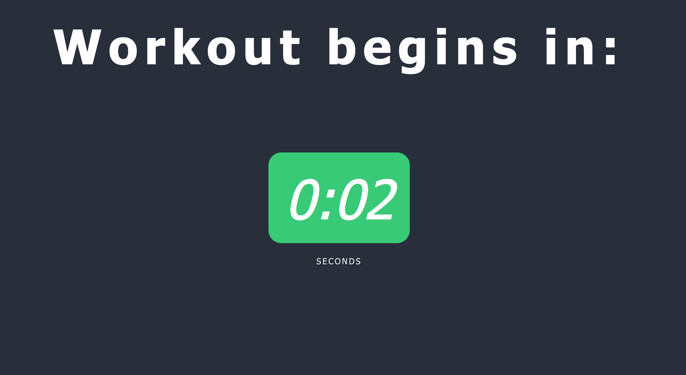
                        
                      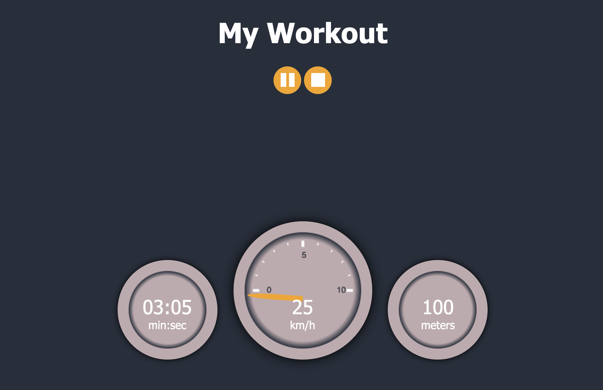
                        
                      We created a JS script that uses socket.io.js (JS file hosted online by socket.io developers) to receive JSON objects from the Python script, parse these JSON objects and assign the resulting data to variables. We make use of HTML DOM element objects to insert these variables into the webpage structure (getElementByID).
                        
                      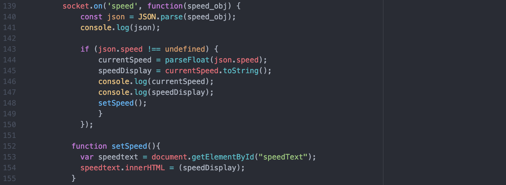
                        
                

<!-- step 8  -->

 Step 8: Google Maps API 

                

                  To implement a Google map in a webpage, a Google Maps Javascript API is needed. For information on how to implement this API, go to https://developers.google.com/maps/documentation/javascript/get-api-key.
                  To actually activate your API key, you need to go to your Google Cloud Platform account page and fill in your credit card information - but don’t worry, using the API is free! In the Javascript file, add   .
                    
                  Additionally, the function initMap needs to be called to initialize the map on the webpage. As shown, a map variable needs to be identified, its zoom in level, center and styles can be customized by you.
                    
                  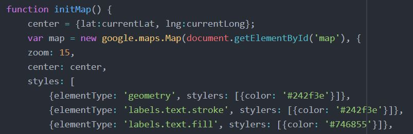
                    
                  To draw out the live route of the user while moving, the position of the user needs to be updated - in this case, once every second. As shown, when the new latitude and longitude come in over the websocket, we combine them as an object and they are added to the locations array. Then the Polyline function will draw out the route based on the locations array. Since we want to draw out a live route which changes all the time, we call the updatePosition function every second.
                    
                  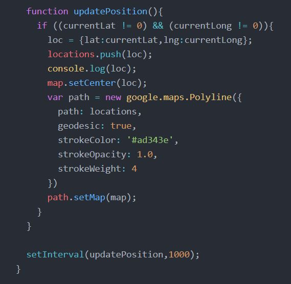
                    
                  For more tutorials about this API, go to https://developers.google.com/maps/documentation/javascript/adding-a-google-map
                    
                

<!-- step 9  -->

 Step 9: Workout summary 

                

                When users press the stop button, all session data must be gathered in the summary page. We created a JS script that uses localStorage to keep track of accumulated user data in a session, then passes it to the summary page HTML.
                  
                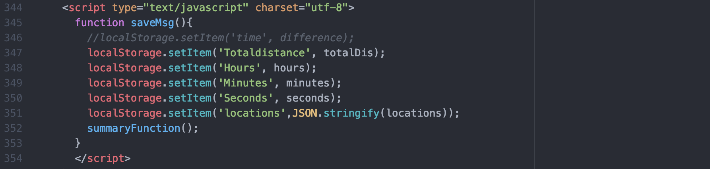
                  
                

         

         
        

       <h2> Videos of the prototype </h2>
<video>
  <source src="IMG_4695.mov" type="video/mp4">
</video>
        
     
     

       

         

           <h2> TU Delft Master Elective  </h2>
         
 PCP stands for Prototyping connected products, an elective from the Industrial Design Engineering master at TU Delft. The elective is an introduction to prototyping IoT connected products. 

            
           
         

         

           <h2> About Us  </h2>
             

               
                
                  
 Caiseal Beardow - DFI 

                   
               
                
                  
 Yu Zhang - IPD 

                   
               
                  
 Kiki Deurvorst- DFI 
   
             

         

         

           <h2> Components </h2>
             

               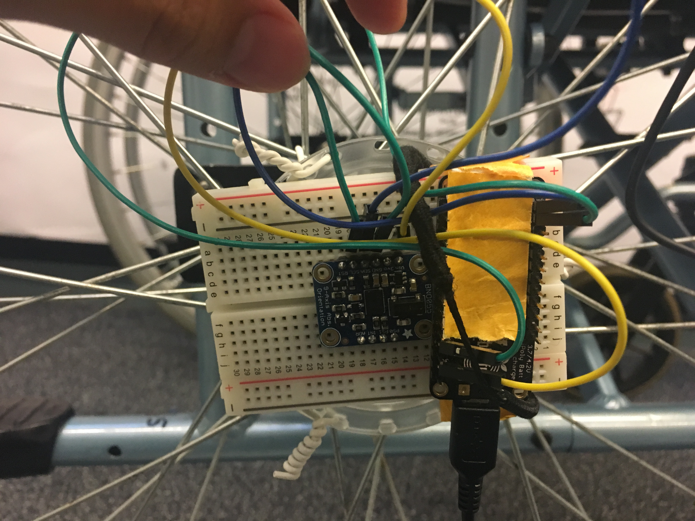
                
                  
 The IMU and feather connected to the wheel of the wheelchair 

                   
                   
               
                
                  
 The GPS sensor on an Arduino Mega, connected to the Pi over serial.  

             

         

       

    

    <!-- 

      <h2>Footer</h2>
    
 -->

  </body>
</html>
