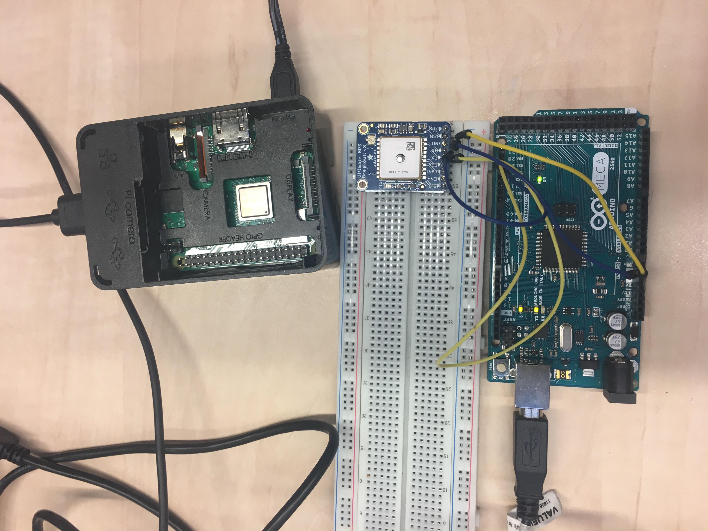

<html lang="en">
  <head>
        <link rel="stylesheet" href="webPage.css">
  </head>

  <body>

     

       <h1>   Prototyping Connected Products  </h1>
       <h3 style="font-size:50%">   Group 3: Caiseal Beardow, Yu Zhang & Kiki Deurvorst </h3>
     

     

       

         

           <h2> Our Project </h2>
           <h5>A connected wheelchair to track live workout data</h5>
           
 Our project aims to support manual wheelchair users in maintaining an active lifestyle. We envision our project as a workout tracker, similar to existing commercial examples, such as NikeRun or FitBit, but adapted specifically to the physical properties of a manual wheelchair and the practicalities of its use. Using sensors, microprocessors and a Raspberry Pi, we connect the physical components of our system to a visual interface that shows users their workout progress and statistics in real-time. 

           
         

         

           <h2> Design Brief </h2>
           <h5>Connecting a wheelchair</h5>
           
 “While the population of wheelchair users is growing worldwide, it becomes urgent to design supportive technologies that fit their needs. We aim to develop products for improvement of the wheelchair users’ wellbeing. This design is a connected product that collects data from sensors and processes it in order to actuate user interactions embedded in the wheelchair.”
                Building upon this brief, we envision our target user group as (either full- or part-time) manual wheelchair users aiming to work towards or maintain a healthier, more active lifestyle. Features of our connected product include location, distance and activity tracking (via GPS and accelerometer sensors), visualised through a UX interface, with the intention of developing a mobile app-based product.
           

         

         

           <h2> System Architecture </h2>
           <h5> A sytematic overview of the architecture used for the prototype </h5>
           
         

         

           <h2> Components </h2>
          
 The core of our connected system is a Raspberry Pi. The Pi runs a central Python script that receives data from sensors, processes it, initialises a server and websocket application, and sends processed data to this websocket.
             
             
            Associated HTML, CSS and JavaScript files are combined to produce an interactive web-based application that visualises users’ workout data in real-time.
              
            We use two sensors to receive relevant data:
             
            Adafruit BNO055 Absolute Orientation Sensor;
             
            Adafruit Ultimate GPS Breakout.
              
            When mounted on the wheelchair’s wheel axle, the BNO sensor provides us with rotation data that is then used to calculate cumulative distance travelled and, in combination with time elapsed,
            a user’s current speed. This data is sent to the Pi via Bluetooth using GATT commands.
              
            The GPS sensor is connected to an Arduino Mega that collects and formats coordinates, then sends them to the Pi via serial communication.
              
            The Python script running on the Pi parses these data and packages them in a format that is usable by the JavaScript files implemented in our web application. Using a websocket, data is visualised in real-time and updated accordingly as the user moves with their wheelchair.
          

         

         

           <h2> Technical Details </h2>
          
 Connection of Feather to BNO055: 

            
 The IMU (BNO055) along with the Feather is placed on the axle of one side of the wheelchair to calculate
              the distance of the wheelchair moves, the current speed of the wheelchair based on its rotation counts.
               
            	3V 	----- 	VIN 
            	GND 	----- 	GND 
            	SDA 	----- 	SDA 
            	SCL 	----- 	SCL
              
             BNO055 is a 9 degrees of freedom IMU contains a gyroscope, an accelerometer and a magnetometer.
             
            For detailed information, go to https://datacentricdesign.org/docs/2019/04/30/sensors-orientation
            

            
 Feather to Pi (BLE) 

            

                  Read GPS on arduino mega
                 
                  An Adafruit Ultimate GPS is connected to Arduino Mega. It collects GPS data of its location automatically once it is turned on.
                  
                  Connection of Mega to GPS: 
                	5V 	----- 	VIN 
                	GND	----- 	GND 
                	RX	----- 	TX1 
                	TX 	----- 	RX1
                    
                  With an empty script running on Mega, the GPS sends raw NMEA data including connected satellite, current time, latitude, longitude, attitude to the serial port. Since only the latitude and longitude is needed to make a location in Google Map, Mega needs to run a script that can parse the raw data and only output the latitude and longitude data. To run the whole script, Adafruit GPS library needs to be added. Below shows the loop function of script, after parsing the NMEA data, the latitude (latdeg) and longitude (longdeg) needs to be printed and thus sent to the serial port. Here Serial.print(latdeg, 8) means in the serial port it prints out the latitude in a float with 8 decimals. If this is not specified, by default only 2 decimal float will be printed and sent by serial port. Google Map does require an 8 decimal float as its latitude and longitude input, so here it is needed to serial print 8 decimal.
                     For detailed information, go to https://datacentricdesign.org/docs/2019/04/30/sensors-gps.
                    
            

            
 Mega to Pi (serial) 

            

                  Read GPS on arduino mega 
                  An Adafruit Ultimate GPS is connected to Arduino Mega. It collects GPS data of its location automatically once it is turned on.
                  
                  Connection of Mega to GPS: 
                	5V 	----- 	VIN 
                	GND	----- 	GND 
                	RX	----- 	TX1 
                	TX 	----- 	RX1
                    
                  With an empty script running on Mega, the GPS sends raw NMEA data including connected satellite, current time, latitude, longitude, attitude to the serial port. Since only the latitude and longitude is needed to make a location in Google Map, Mega needs to run a script that can parse the raw data and only output the latitude and longitude data. To run the whole script, Adafruit GPS library needs to be added. Below shows the loop function of script, after parsing the NMEA data, the latitude (latdeg) and longitude (longdeg) needs to be printed and thus sent to the serial port. Here Serial.print(latdeg, 8) means in the serial port it prints out the latitude in a float with 8 decimals. If this is not specified, by default only 2 decimal float will be printed and sent by serial port. Google Map does require an 8 decimal float as its latitude and longitude input, so here it is needed to serial print 8 decimal.
                   
                   For detailed information, go to https://datacentricdesign.org/docs/2019/04/30/sensors-gps.
                   
            

         

         

           <h2> Process Overview </h2>

            
 1. Read speed & distance data on BNO and prepare for broadcasting using GATT service (BNO_FEATHER_TO_PI.ino) 

              

              Read data from BNO with on feather  
              Process data on feather  (distance and speed) 
              Create GATT characteristics for speed and distance  
              Create GATT service (using ID’s)
              
  

            
 2. Subscribe to GATT service (WorkoutVis.py) 

              

              Define characteristics in python script using ID’s   
              Initialise Bluetooth adapter using pygatt library 
              Use PYGATT library to subscribe to characteristics set in arduino script
              
 

            
 3. Read and print GPS data over serial (GPS_parsing.ino) 

              

              Read longitude and latitude from gps sensor    
              Parse using adafruit library  
              Printing it over serial
              
 

            
 4. Read and process GPS data from serial (WorkoutVis.py) 

              

              In python, we create a serial communication function that opens a connection with the serial port  
              Read incoming data and decode it (coming in as bytes  
              Place incoming data in an array and split by commas (strip and split functions) 
              Assign relevant index values to latitude and longitude variables  
              Place serial comms function inside thread - this separates out serial comms from the rest of the code and allows it to run concurrently. If we didn’t do this, serial comms would block the rest of the code as it includes a while loop.
              
 

              
 5. Set up websocket (WorkoutVis.py) 

              

              Set up websocket using flask and flask.io, creating routes for each app address (1 address = 1 HTML file) 
              Emit data as JSON objects, broadcasting to all instances of web page 
              Create websocket functions corresponding to each JSON object type
              
 

              
 6. Actuate data through online webPage (html/css/js - start/workout/summary) 

              

              Create web interface with HTML/CSS - three pages (start/workout/summary), link them together using Javascript  
              Create JS script that uses socket.io.js (JS file hosted online by socket.io developers) to receive JSON objects from Python script, parse JSON objects and assign the resulting data to variables 
              Use HTML DOM element objects to insert these variables into webpage structure (i.e. displayed text) 
              Use Google Maps API to use variables produced from GPS JSON objects as map coordinates  
              Create JS script that uses localStorage to keep track of accumulated user data in a session, then passes it to summary page HTML
              
  

            

          

       

         

           <h2> TU Delft Master Elective  </h2>
         
 PCP stands for Prototyping connected products, an elective from the Industrial Design Engineering master at TU Delft. The elective is an introduction to prototyping IoT connected products. 

            
           
         

         

           <h2> About Us  </h2>
             

               
                
                  
 Caiseal Beardow - DFI 

                   
               
                
                  
 Yu Zhang - IPD 

                   
               
                  
 Kiki Deurvorst- DFI 
   
             

         

         

           <h2> Components </h2>
             

               
                
                  
 The IMU and feather connected to the wheel of the wheelchair 

                   
                   
               
                
                  
 The GPS sensor on an Arduino Mega, connected to the Pi over serial.  

             

         

       

    

    <!-- 

      <h2>Footer</h2>
    
 -->

  </body>
</html>
