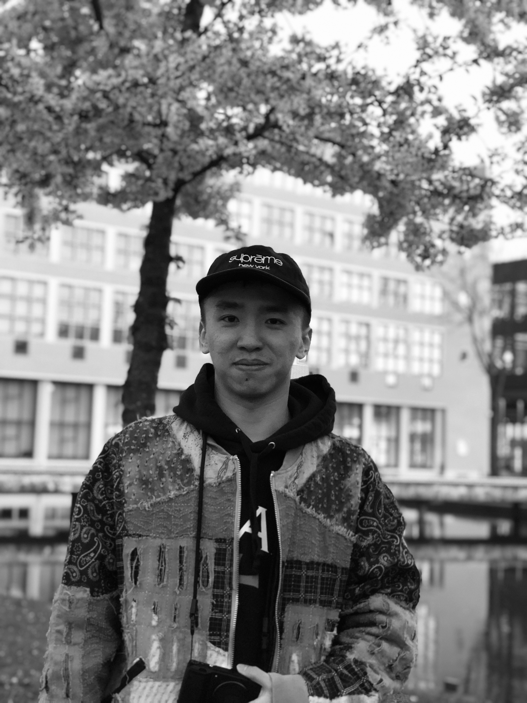

<html lang="en">
  <head>
        <link rel="stylesheet" href="webPage.css">
  </head>

  <body>

     

       <h1>   Prototyping Conncected Products  </h1>
       <h3 style="font-size:50%">   Group 3: Caiseal Beardow, Yu Zhang & Kiki Deurvorst </h3>
     

     

       

         

           <h2> Our Project </h2>
           <h5>A connected wheelchair to track live workout data</h5>
           
 Our project aims to support manual wheelchair users in maintaining an active lifestyle. We envision our project as a workout tracker, similar to existing commercial examples, such as NikeRun or FitBit, but adapted specifically to the physical properties of a manual wheelchair and the practicalities of its use. Using sensors, microprocessors and a Raspberry Pi, we connect the physical components of our system to a visual interface that shows users their workout progress and statistics in real-time. 

           
         

         

           <h2> Design Brief </h2>
           <h5>Connecting a wheelchair</h5>
           
 “While the population of wheelchair users is growing worldwide, it becomes urgent to design supportive technologies that fit their needs. We aim to develop products for improvement of the wheelchair users’ wellbeing. This design is a connected product that collects data from sensors and processes it in order to actuate user interactions embedded in the wheelchair.”
                Building upon this brief, we envision our target user group as (either full- or part-time) manual wheelchair users aiming to work towards or maintain a healthier, more active lifestyle. Features of our connected product include location, distance and activity tracking (via GPS and accelerometer sensors), visualised through a UX interface, with the intention of developing a mobile app-based product.
           

         

         

           <h2> System Architecture </h2>
           <h5> A sytematic overview of the architecture used for the prototype </h5>
           
         

         

           <h2> Components </h2>
          
 The core of our connected system is a Raspberry Pi. The Pi runs a central Python script that receives data from sensors, processes it, initialises a server and websocket application, and sends processed data to this websocket.
             
             
            Associated HTML, CSS and JavaScript files are combined to produce an interactive web-based application that visualises users’ workout data in real-time.
              
            We use two sensors to receive relevant data:
             
            Adafruit BNO055 Absolute Orientation Sensor;
             
            Adafruit Ultimate GPS Breakout.
              
            When mounted on the wheelchair’s wheel axle, the BNO sensor provides us with rotation data that is then used to calculate cumulative distance travelled and, in combination with time elapsed,
            a user’s current speed. This data is sent to the Pi via Bluetooth using GATT commands.
              
            The GPS sensor is connected to an Arduino Mega that collects and formats coordinates, then sends them to the Pi via serial communication.
              
            The Python script running on the Pi parses these data and packages them in a format that is usable by the JavaScript files implemented in our web application. Using a websocket, data is visualised in real-time and updated accordingly as the user moves with their wheelchair.
          

         

       

       

         

           <h2> TU Delft Master Elective  </h2>
         
 PCP stands for Prototyping connected products, an elective from the Industrial Design Engineering master at TU Delft. The elective is an introduction to prototyping IoT connected products. 

            
           
         

         

           <h2> About Us  </h2>
             

               
                
                  
 Caiseal Beardow - DFI 

                    
               
                
                  
 Yu Zhang - IPD 

                    
               
                  
 Kiki Deurvorst- DFI 

                   
             

         

       

    

    <!-- 

      <h2>Footer</h2>
    
 -->

  </body>
</html>
